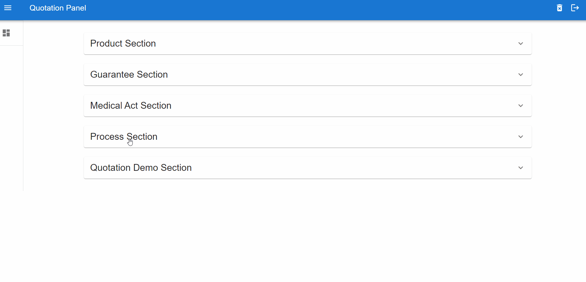

# Welcome to Quotation Simulator Backoffice Sample App

This app is made for learning purposes to understand how to build quotation process and sales strategy in insurance domain. So far, there is no database or backend services. It's 100% frontend with local storage persistence.

  
Click To check the Demo

  

## Prerequisites and Techs

- Nodejs v18 (minimum)
- React, Material UI
- Redux
- Typescript
- Vitejs
